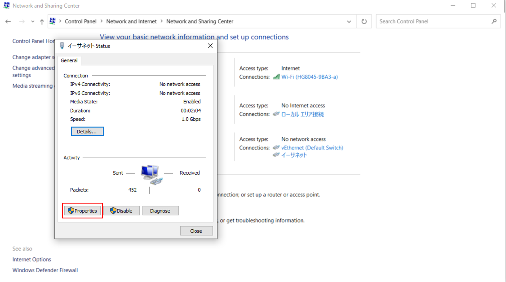
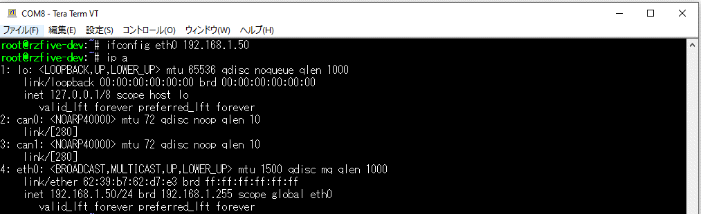

# 1. Overview

This document describes the steps required to run the "IoT Edge demo with multiple sensors and LEDs(hereinafter called “Demo Application”)" on the target evaluation boards listed below.


The configuration of this Demo Application and the equipment required to run the Demo Application are shown below.

## Structure of the Demo Application

  

## System equipment diagram

   

## Required Equipment

The following is a list of items required to run this Demo Application.

### Target Evaluation board

- RZ/G2UL reference board
  - RZ/G2UL Evaluation board Kit (smarc-rzg2ul)
    - RZ/G2UL SMARC Module Board 
    - RZ SMARC Series Carrier Board 

- RZ/Five reference board
  - RZ/Five Evaluation board Kit (smarc-rzfive)
    - RZ/Five SMARC Module Board 
    - RZ SMARC Series Carrier Board 


### Sensors
- [US082-HS3001EVZ (Relative Humidity Sensor Pmod™ Board (Renesas Quick-Connect IoT))](https://www.renesas.com/us/en/products/sensor-products/humidity-sensors/us082-hs3001evz-relative-humidity-sensor-pmod-board-renesas-quick-connect-iot)

- [US082-OB1203EVZ (Pulse Oximetry, Proximity, Light, and Color Sensor Pmod™ Board (Renesas Quick-Connect IoT))](https://www.renesas.com/us/en/products/sensor-products/biosensors/us082-ob1203evz-pulse-oximetry-proximity-light-and-color-sensor-pmod-board-renesas-quick-connect-iot)

### LED
- [Pmod LED Four High-brightness LEDs(hereinafter called “Pmod LED”)](https://www.digikey.com/en/products/detail/digilent-inc/410-076/4090177)

### Others

- ① USB Type-C cable (e.g. “AK-A8485011”)
- ② USB Power Delivery Charger (e.g. “PowerPort III 65W Pod”)
- ③ USB micro Type-B (included in Evaluation board Kit) 
- ④ LAN cable
- ⑤ micro SD card (e.g. Transcend 8GB )
- ⑥ Windows 10 PC  
  
# 2. How to build BSP

This section provides a guide to prepare RZ/Five and RZ/G2UL reference boards to boot up.

The following versions have been confirmed to work.
Please build with "core-image-minimal".

- A) Verified Linux Package (v3.0.2-update1)    
  Download Link: [RZ/Five Verified Linux Package v3.0.2-update1](https://www.renesas.com/us/en/document/sws/rzfive-verified-linux-package-v302-update1?r=11114011)

- B) Yocto Build layer (v3.0.2-update1)     
GitHub Link: [official RZ/G2 series Yocto Poky BSP based on the CIP kernel(tag:BSP-3.0.2-update1) ](https://github.com/renesas-rz/meta-renesas/tree/BSP-3.0.2-update1)  


1. Build Rootfs and Kernel

   Please refer "3.1 Building images to run on the board"(A) or "Build Instructions"(B).

   Just before building the BSP, run the following command to add the packages required to run the demo app to `${WORK}/build/conf/local.conf`.

    ```
    $ echo IMAGE_INSTALL_append = \"libwebsockets jansson\" >> conf/local.conf
    ```  
   note: proprietary graphics and multimedia drivers are not required.

2. Build toolchain
   Please refer "3.2 Building SDK"(A) or "Build Instructions for SDK"(B). 

   The resulting SDK installer will be located in `build/tmp/deploy/sdk/`.  

   [RZ/FIVE] poky-glibc-x86_64-core-image-minimal-riscv64-smarc-rzfive-toolchain-3.1.17.sh  
   [RZ/G2UL] poky-glibc-x86_64-core-image-minimal-aarch64-smarc-rzg2ul-toolchain-3.1.17.sh

3. Install toolchain

   To run the installer, you would execute the following command:
   
   [RZ/FIVE]
   ```
   $ sudo sh poky-glibc-x86_64-core-image-minimal-riscv64-smarc-rzfive-toolchain-3.1.17.sh 

   Poky (Yocto Project Reference Distro) SDK installer version 3.1.17
   =============================================
   Enter target directory for SDK (default: /opt/poky/3.1.17):
   You are about to install the SDK to "/opt/poky/3.1.17". Proceed [Y/n]? y
   Extracting SDK...................................................................done
   Setting it up...done
   SDK has been successfully set up and is ready to be used.
   Each time you wish to use the SDK in a new shell session, you need to source the environment setup script e.g.
   ```

   [RZ/G2UL]
   ```
   $ sudo sh poky-glibc-x86_64-core-image-minimal-aarch64-smarc-rzg2ul-toolchain-3.1.17.sh

   Poky (Yocto Project Reference Distro) SDK installer version 3.1.17
   ==================================================================
   Enter target directory for SDK (default: /opt/poky/3.1.17):
   You are about to install the SDK to "/opt/poky/3.1.17". Proceed [Y/n]? y
   Extracting SDK...................................................................done
   Setting it up...done
   SDK has been successfully set up and is ready to be used.
   Each time you wish to use the SDK in a new shell session, you need to source the environment setup script e.g.
   ```


4. Setup toolchain  
   [RZ/FIVE]

   ```
   $ source /opt/poky/3.1.17/environment-setup-riscv64-poky-linux
   ```

   [RZ/G2UL]
   ```
   $ source /opt/poky/3.1.17/environment-setup-aarch64-poky-linux
   ```

# 3. WebSocket Demonstration

This chapter describes the procedures for running Demo Application.

## 3.1 How to build Demo Application

1. Copy the `demo_env` folder on your Linux PC

   ```bash
   $ git clone https://github.com/renesas-rz/rzfive_smarc_sample_code
   ```

1. Build
   
   ```bash
   $ mkdir rzfive_smarc_sample_code/demo_env/apps/sources/build
   $ cd rzfive_smarc_sample_code/demo_env/apps/sources/build
   $ cmake ..
   $ make
   ```

1. Place the built Demo Application binary in the appropriate location

   ```bash
   $ mv lws-minimal-ws-server-threads ../../
   ```


## 3.2.  Boot board

- Show the layout of main components of the board

   

### 3.2.1. Write bootloader to board
   - Please refer [RZ/G2L Group, RZ/V2L, and RZ/Five SMARC EVKStart-up Guide](https://www.renesas.com/jp/ja/document/mas/board-start-guide-rzg2l-rzg2lc-rzg2ul-rzv2l-rzfive-smarc-evk-rev102?language=en&r=1467981)  (1.2 Startup Procedure to 1.4 Writing Bootloader).
  
   - Required files
      - RZ/Five
         - Flash_Writer_SCIF_RZFIVE_SMARC.mot
         - spl-smarc-rzfive.srec
         - fit-smarc-rzfive.srec
      - RZ/G2UL
         - Flash_Writer_SCIF_RZG2UL_SMARC_DDR4_1GB_1PCS.mot
         - bl2_bp-smarc-rzg2ul.srec
         - fip-smarc-rzg2ul.srec


### 3.2.2. Write image to SDCard
   
   - Required files
      - RZ/Five
         - core-image-minimal-smarc-rzfive.tar.bz2
         - Image-smarc-rzfive.bin
         - Image-r9a07g043f01-smarc.dtb
      - RZ/G2UL
         - core-image-minimal-smarc-rzg2ul.tar.bz2
         - Image-smarc-rzg2ul.bin
         - Image-r9a07g043u11-smarc.dtb


 
   1. Format SDCard
 
  **Remarks: Please change `/dev/sdX` to match your environment**

  ```bash
      $ sudo umount /dev/sdX
      $ sudo fdisk /dev/sdX
      d
      n        // create partition 1 for kernel and device tree
      Enter
      1
      Enter
      +1G
      n        // create partition 2 for rootfs
      Enter
      2
      Enter
      Enter
      w
  ```

 

   1. Create a file system

      1. Set vfat partition for kernel and device tree

         ```bash
         $ sudo mkfs.vfat -v -c -F 32 /dev/sdX1
         ```

      1. Set ext4 partition for rootfs

         ```bash
         $ sudo mkfs.ext4 -L rootfs /dev/sdX2
         ```

   1. Write kernel Image
   **Remarks: For RZ/G2UL, please change the file name for RZ/FIVE or RZ/G2UL.

      ```bash
      $ sudo mount /dev/sdX1 /mnt
      $ sudo cp Image-smarc-XXXX.bin /mnt
      $ sudo cp Image-r9a07g043XXX-smarc.dtb /mnt
      $ sync
      $ sudo umount /mnt
      ```

   1. Write Rootfs

      ```bash
      $ sudo mount /dev/sdX2 /mnt
      $ sudo tar -jxf core-image-minimal-smarc-XXXXX.tar.bz2 -C /mnt
      $ sync
      $ sudo umount /mnt
      ```

### 3.2.3. Deploy Demo Application

There are two ways to deploy Demo Applications on Board, so choose the operation that best suits your needs.

- Directly to SDCard
   ```bash
   $ sudo mount /dev/sdX2 /mnt
   $ sudo cp -r demo_env/ /mnt/home/root
   $ sync
   $ sudo umount /mnt
   ```

- Transfer Demo Application using scp

   **If you want to transfer the Demo Application to Board over the network, complete the `Network settings` chapter**

   ```bash
   $ scp -r ./IoT_Edge_demo_with_multiple_sensors_and_LED/demo_env/ root@<your Board IP adddress>:
   ```

### 3.2.4. PMOD Setting

1. To use PMOD1 with Type 6A, set SW1 to SW8 as shown in the following image

   

1. Connect Sensors(US082-HS3001EVZ and US082-OB1203EVZ) to `PMOD1`

1. Connect LED(Pmod LED) to `PMOD0`

   

### 3.2.5. SD Boot

1. Board switch setting, the following switch setting makes board to boot from SDCard

   

   

1. Insert an SDCard into the `SDCard slot` on the side of the Carrier board, connect the LAN cable to the `Ethernet1 Connector`, then press and hold the `Power Switch` for at least 1 second to start the board

1. Apply the following settings to U-boot and boot the board

   [RZ/FIVE]
   ```
   => setenv bootargs 'root=/dev/mmcblk1p2 rootwait'
   => setenv bootcmd 'mmc dev 1;fatload mmc 1:1 0x48080000 Image-smarc-rzfive.bin; fatload mmc 1:1 0x48000000 Image-r9a07g043f01-smarc.dtb; booti 0x48080000 - 0x48000000'
   ```

   [RZ/G2UL]
   ```
   => setenv bootargs 'root=/dev/mmcblk1p2 rootwait'
   => setenv bootcmd 'mmc dev 1;fatload mmc 1:1 0x48080000 Image-smarc-rzg2ul.bin; fatload mmc 1:1 0x48000000 Image-r9a07g043u11-smarc.dtb; booti 0x48080000 - 0x48000000'
   ```

   Save the U-boot settings.
   ```
   => saveenv
   Saving Environment to MMC... Writing to MMC(0)... OK

   => run bootcmd
   ```
  

2. Log in

   ```
   smarc-rzfive login: root
   ```

## 3.3. Network settings

To make a P2P connection between board and a Windows 10 PC to run the Demo Application, configure the following network settings

### 3.3.1. Windows 10 PC network settings

1. Open the Control Panel on a Windows 10 PC

   

1. Click on `Network and Internet` to open the `Network and Sharing Center`

   

   

1. Confirm that the board `Ethernet1 Connector` and the Windows 10 PC are connected with a LAN cable

1. After a few moments, `Unidentified Network` will appear, click on `Ethernet` to open `properties`

   

   

1. Open `Internet Protocol Version 4 (TCP/IPv4)` and configure as follows:

   
   
   

   1. Click `Use the following IP address:`
   1. Enter `IP address` and `Subnet mask`
   1. Click OK when settings are complete

## 3.3.2. Board network settings

1. Execute the following command on board to set the IP address

   ```
   # ifconfig eth0 192.168.1.50 netmask 255.255.255.0
   ```

   Check the IP address is set in eth0

   ```
   # ip a
   ```

   

## 3.4 Launch Demo Application 

1. Run Application

   ```
   # cd demo_env
   # chmod +x apps/lws-minimal-ws-server-threads
   # ./apps/lws-minimal-ws-server-threads
   [2022/03/09 05:59:33:5429] U: LWS minimal ws server + threads | visit http://localhost:3000
   ```

   Tip: 
      - All LEDs are turned off when the Demo Application is started.
      - If you do not specify an update interval for the demo app in the command line argument, the update interval is set to the default of 250 ms.
      See `(Optional) Update Interval for Demo Apps` for details.
   
   Access the following URL from Firefox on a Windows 10 PC
   > ` http://192.168.1.50:3000`

   

   - (Optional) Update Interval for Demo Apps

      If you want to change the update interval of the demo app, specify the interval as a command line argument when the app is run
      
      ```
      # ./apps/lws-minimal-ws-server-threads (interval)
      ```

      ```
      interval(ms):

      This argument is optional.

      If the argument is not specified, an update interval of 250 ms is specified for the measurement results.
      The supported range is `>= 250`.
      ```

1. (Optional) If you have configured board with an IP address other than the one listed in the manual, modify line 9 of board's demo_env/js/websocket_demo.js as follows:

   ```
   diff --git a/demo_env/js/websocket_demo.js b/demo_env/js/websocket_demo.js
   index 6a27088..5e8c7a9 100644
   --- a/demo_env/js/websocket_demo.js
   +++ b/demo_env/js/websocket_demo.js
   @@ -6,7 +6,7 @@
   * see https://opensource.org/licenses/MIT
   */
   
   -var socket = new WebSocket("ws://192.168.1.50:3000/", "graph-update");
   +var socket = new WebSocket("ws://<your ip address>:3000/", "graph-update");
   var ctx = document.getElementById("canvas").getContext("2d");
   var state = "auto";
   var thresh = "";
   ```

### Demo Application Settings

### Overview
#### Settings screen

- The following items can be set on the settings screen
   1. Graph settings
   1. Threshold to turn on LED settings

- By clicking on the icon in the red frame of the image, a screen for setting the vertical axis of the graph in the Demo Application will appear

   

- To close the settings screen, click the X icon in the red frame of the image

   

#### Reflection of settings

1. There are two ways to change the contents of the input form on the settings screen

   
      
1. To apply the settings, press `Enter` with the input form in focus

   

#### Graph settings

- The setting items are linked to the vertical axis of the graph as shown in the figure below

  

#### Threshold to turn on LED settings

- The LED will turn on when the proximity `Current value` is greater than the set `Threshold to turn on LED value`

    
